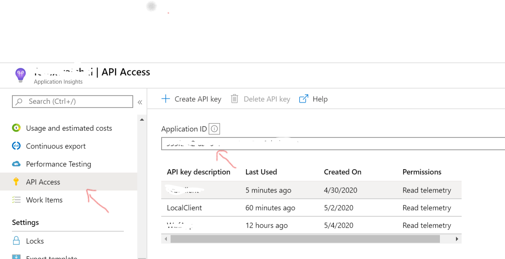
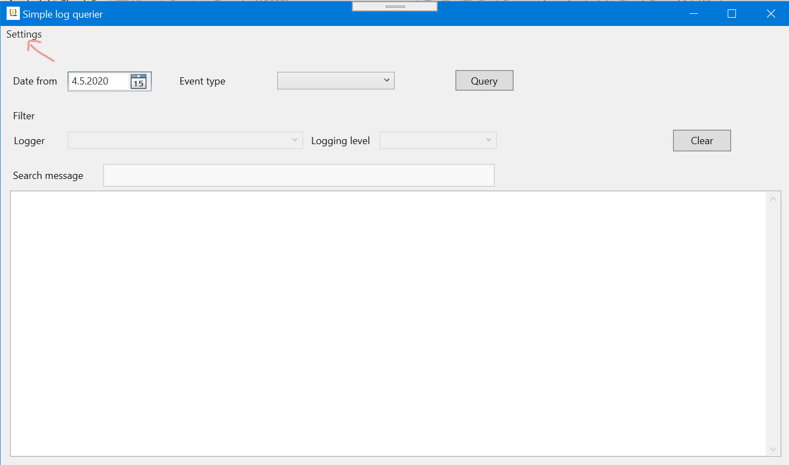
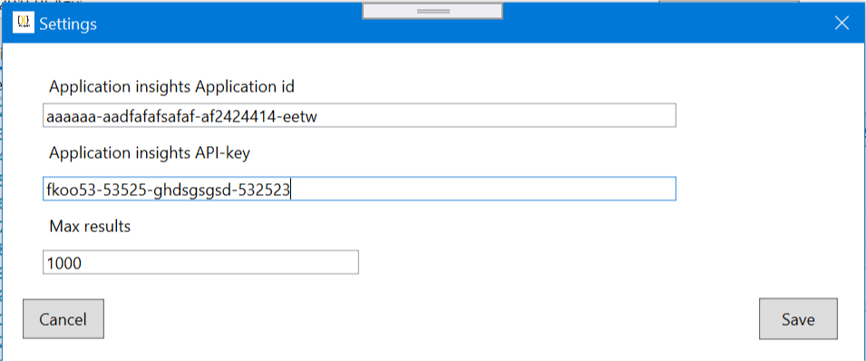
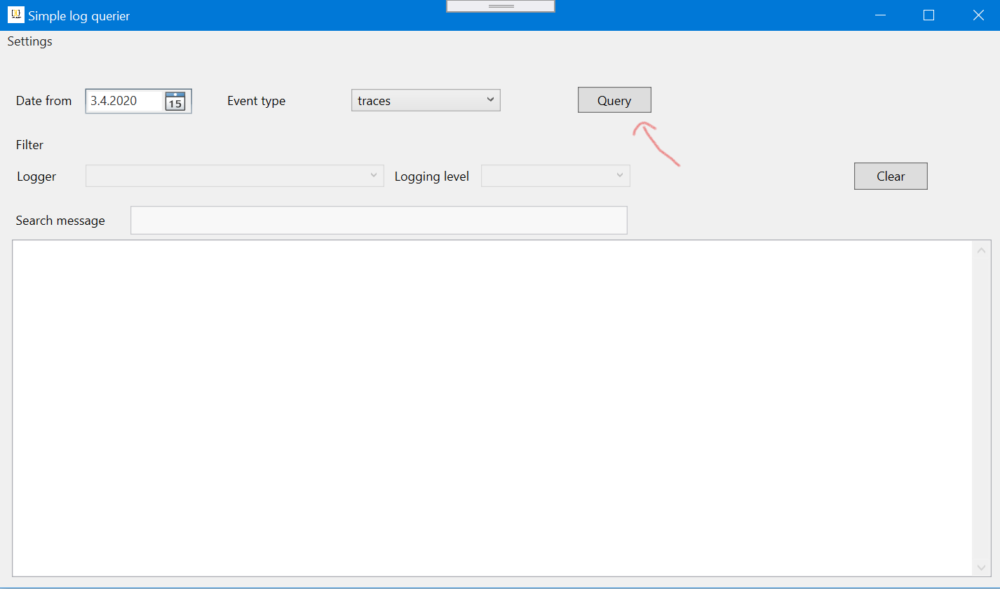
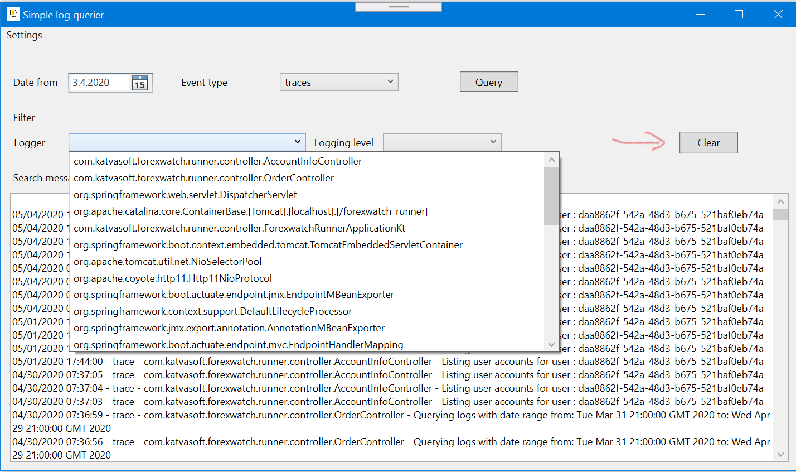

**Really simple Azure Application Insights query tool**

This is really simple Azure Application Insight (AI) query tool. With this tool you can query trace logs from the application insights. All you need is the Application Insights Application Id and the API key.

You can find the binaries here:

https://1drv.ms/u/s!AtV6YEMzuD69htUmwRmqFFyGPyALag?e=uT1qV6

There two zip-files. One contains everything needed to run the application and consist only the application binaries. If you have .NET Core installed the only the application binaries is needed.

After unzipping the file, then run : AzureAppInsightsSimpleQuery.exe and you ready to go.

Open the Settings menu :

Define the Application Insights Application Id and the API-key and the max rows returned from the query.

Then you can query the trace logs from the AI. You must define date from which you querying the logs and the event type. Then pressing the query button will fetch the logs from AI.

After querying the the logs you can filter the results by selecting the logger, logging level. You can also search the message payload by typing into the "Search message"-textbox.

